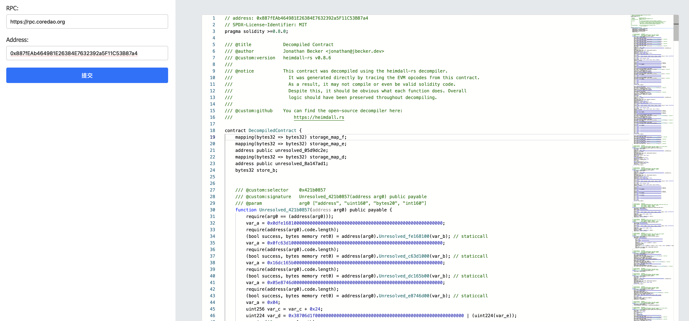

## description

For convenience, a simple webpage is made. The backend calls heimdalld to decompile the solidity contract. If it is a proxy contract, it will automatically find the implementation contract and then display the decompilation result of the implementation contract.

## build

```shell
cargo build
```

## use
```shell
./heimdall-dec
```
After running the program, visit [http://127.0.0.1:8080](http://127.0.0.1:8080)

Then enter the rpc link and the contract address you need to view.



You can get the public RPC links of each chain from [https://chainlist.org](https://chainlist.org)
